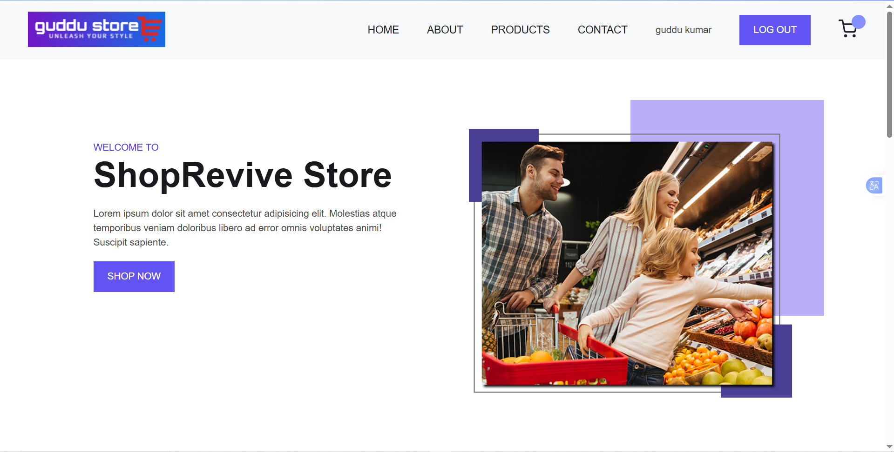
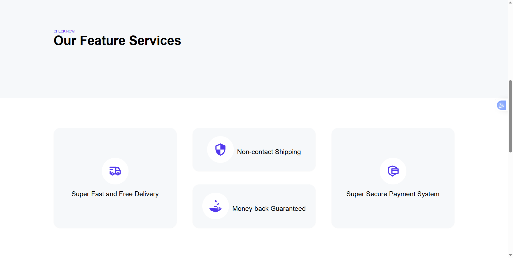
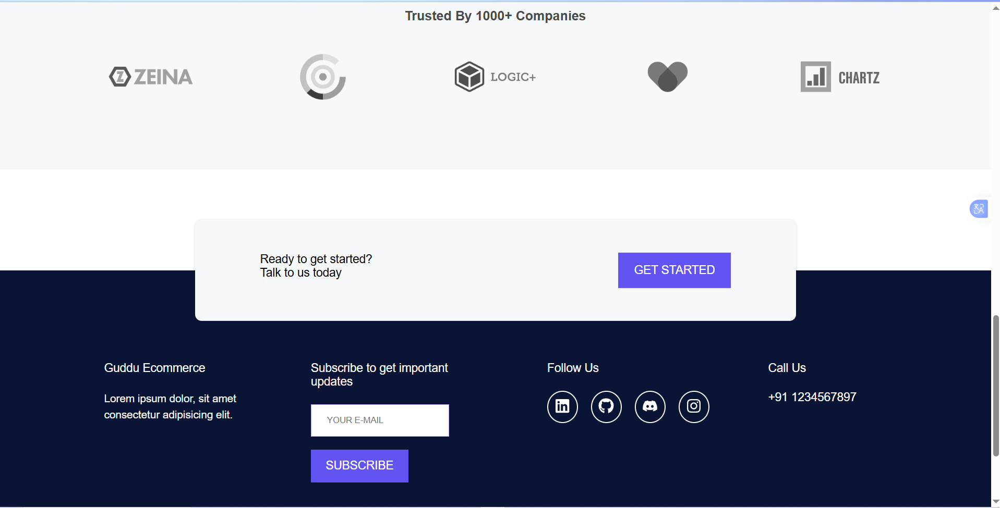
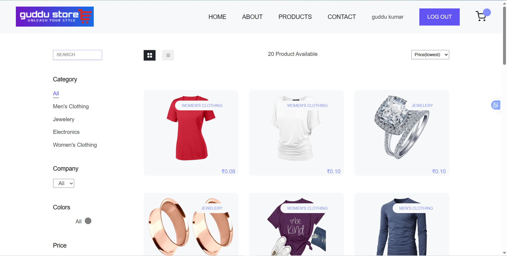
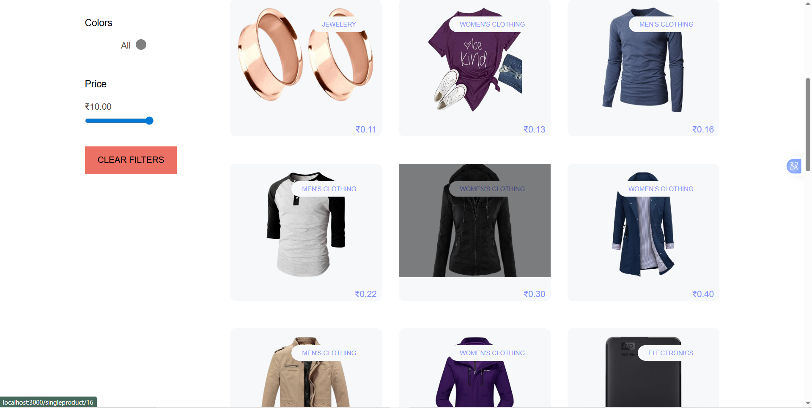
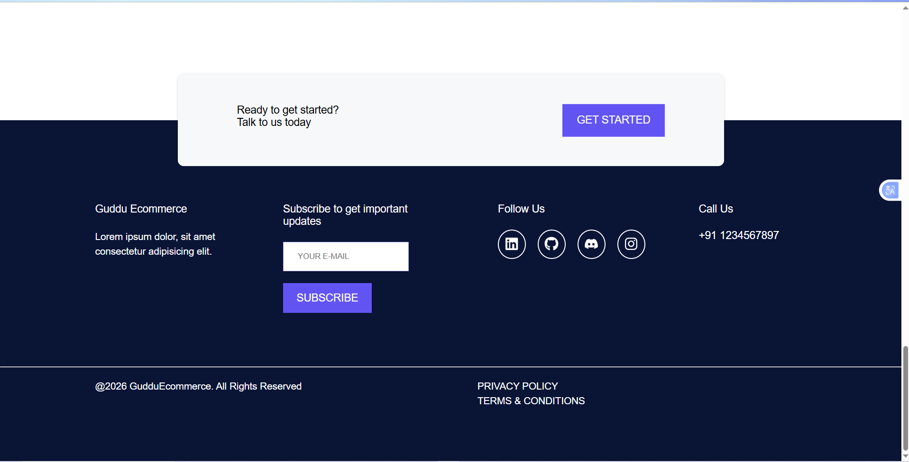
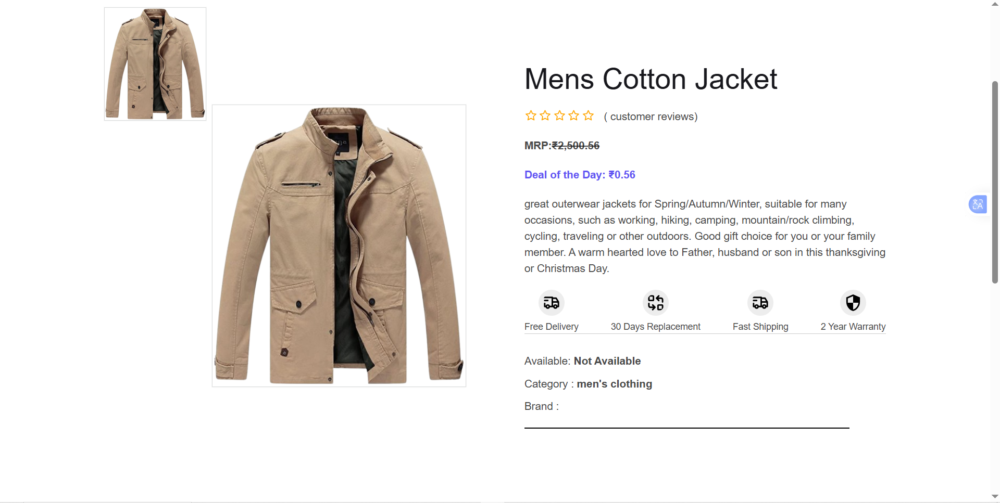
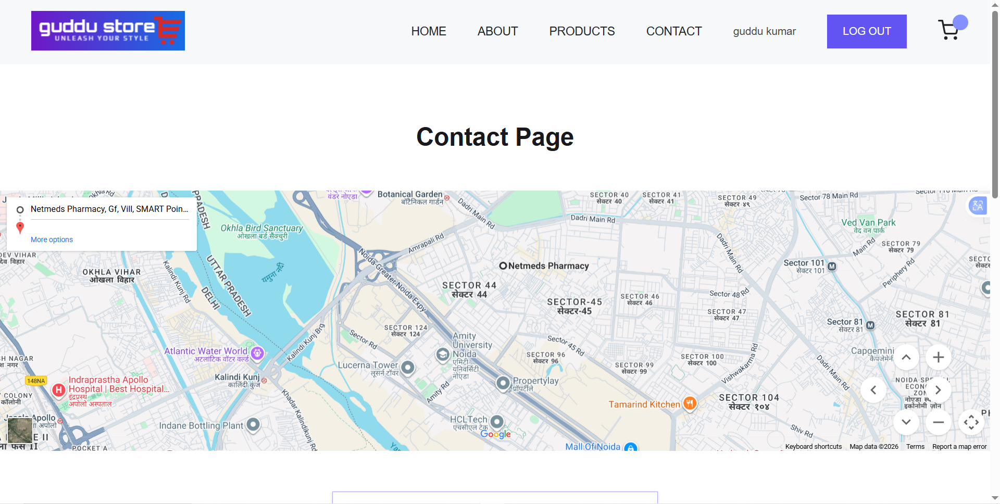
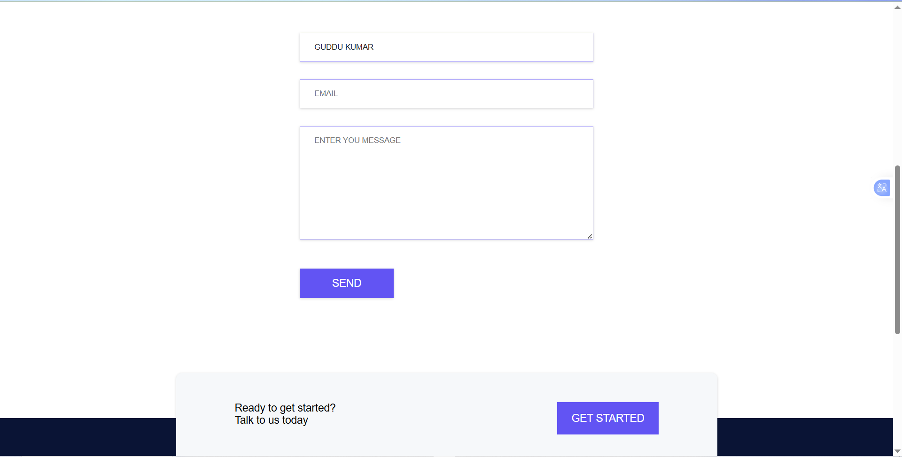
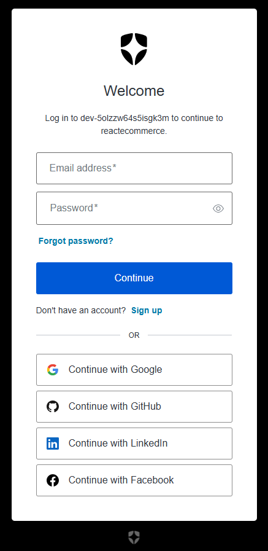

<h1 align="center">🛒 ShopRevive – E-Commerce Website</h1>

<p align="center">
A modern, secure and responsive e-commerce web application built with React and Auth0 authentication.
</p>

---

## 🌐 Live Demo

🔗 https://shoprevive.netlify.app

---

## 📂 GitHub Repository

🐙 https://github.com/KrGuddu/e-commerce-apps

---

## 📸 Screenshots

### Home Page




### Product Page




### Product Details Page


### Contact Page



### Login (Auth0)


---

## 🧾 About This Project

ShopRevive is a modern React-based e-commerce web application focused on performance, usability, and security. It includes essential shopping features such as product listing, product details, cart functionality, and a fully responsive user interface.

The project integrates **Auth0** authentication to provide secure login and logout, **protected routes**, and authentication-based UI rendering. It is built using a clean, component-based architecture and serves as a strong foundation for production-ready e-commerce platforms.

---

## ✨ Features

- 🛍️ Product listing with dynamic data
- 🔍 Product details page
- 🛒 Add to cart functionality
- 🔐 Secure authentication using **Auth0**
- 👤 Login / Logout with Auth0
- 🔒 Protected routes for authenticated users
- 📱 Fully responsive design
- ⚡ Fast and smooth UI experience

---

## 🔐 Authentication (Auth0)

- Authentication handled using **Auth0**
- Secure login & logout flow
- User session management via Auth0 SDK
- Protected routes accessible only after login
- Conditional UI rendering based on auth state

*(Backend integration can be added easily in future if required)*

---

## 🛠️ Tech Stack

- React  
- JavaScript (ES6+)  
- Auth0 (Authentication & Authorization)  
- HTML5  
- CSS3
- Netlify (Deployment)

---

## ▶️ Run This Project Locally

```bash
# Clone the repository
git clone https://github.com/KrGuddu/e-commerce-apps.git

# Navigate to the project directory
cd e-commerce-apps

# Install dependencies
npm install

# Start the development server
npm start

```

## 👨‍💻 Author
**Mr. Guddu Kumar**  
Frontend / React Developer

🌐 Portfolio: https://krguddu.netlify.app

🐙 GitHub: https://github.com/KrGuddu
